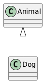

# Class Relationships

---

## 1. Inheritance ("is-a")

**Meaning**: One class is a special kind of another class. Child gets everything from parent (reuse + polymorphism).

**Inheritance = “IS-A” relationship**

It allows a class (child / derived class) to inherit:

- Attributes (data members)
- Methods (member functions)

from another class (parent/base class).

**Lifetime**: Child object contains parent part automatically — they live & die together in memory layout.

**Strength**: **Very strong** coupling

**C++ Example** (very common):

```cpp
class Animal {          // Parent
public:
    void eat() { std::cout << "eating...\n"; }
};

class Dog : public Animal {   // Child — "is-a" Animal
public:
    void bark() { std::cout << "woof!\n"; }
};

int main() {
    Dog d;
    d.eat();   // inherited
    d.bark();
}
```

**PlantUML** (arrow points to parent):

```
@startuml
class Animal
class Dog
Animal <|-- Dog
@enduml
```



---

**C++ Example 2:**

- `Student` **is a** `Person`
- `Teacher` **is a** `Person`

That means:

> Student IS-A Person
> 
> 
> Teacher IS-A Person
> 

---

🔹 Base Class: `Person`

```cpp
#include <iostream>
#include <string>
using namespace std;

// Base class
class Person {
protected:
    string name;
    int age;

public:
    Person(string n, int a) : name(n), age(a) {}

    void display() const {
        cout << "Name: " << name << ", Age: " << age << endl;
    }
};
```

---

🔹 Derived Class: `Student`

```cpp
// Derived class
class Student : public Person {
private:
    string major;

public:
    Student(string n, int a, string m)
        : Person(n, a), major(m) {}

    void displayStudent() const {
        display();  // inherited function
        cout << "Major: " << major << endl;
    }
};

int main() {
    Student s("Alice", 20, "Computer Science");
    s.displayStudent();
    return 0;
}
```

✅  PlantUML Class Diagram (Inheritance)

```
@startuml

class Person {
  - name : string
  - age : int
  + Person(n : string, a : int)
  + display() : void
}

class Student {
  - major : string
  + Student(n : string, a : int, m : string)
  + displayStudent() : void
}

Person <|-- Student

@enduml
```


---

🔎 Why This is Inheritance?

```cpp
class Student : public Person
```

- `Student` inherits from `Person`
- Student gets `name`, `age`, and `display()`
- No need to rewrite common code

---

✅ Types of Inheritance in C++

### 1️⃣ Single Inheritance

One child, one parent

`Student → Person`

### 2️⃣ Multilevel Inheritance

Grandparent → Parent → Child

Example:

```cpp
class GraduateStudent : public Student
```

### 3️⃣ Multiple Inheritance

One class inherits from multiple classes

```cpp
class TeachingAssistant : public Student, public Employee
```

---

---

🔺 Inheritance Symbol in UML

```
Person <|-- Student
```

- Hollow triangle arrow
- Points to the parent class
- Means “IS-A”

---

**C++ Example 3:**

🔹 Base Class: `Person`

🔹 Derived Classes: `Student`, `Teacher`

```cpp
#include <iostream>
#include <string>

using namespace std;

// Base Class
class Person {
protected:
    string name;
    int age;

public:
    Person(string n, int a) : name(n), age(a) {}

    void displayPersonInfo() const {
        cout << "Name: " << name << ", Age: " << age << endl;
    }
};

// Derived Class 1
class Student : public Person {
private:
    string major;

public:
    Student(string n, int a, string m)
        : Person(n, a), major(m) {}

    void displayStudentInfo() const {
        displayPersonInfo();
        cout << "Major: " << major << endl;
    }
};

// Derived Class 2
class Teacher : public Person {
private:
    double salary;

public:
    Teacher(string n, int a, double s)
        : Person(n, a), salary(s) {}

    void displayTeacherInfo() const {
        displayPersonInfo();
        cout << "Salary: $" << salary << endl;
    }
};

int main() {
    Student s("Alice", 20, "Computer Science");
    Teacher t("Dr. Smith", 45, 75000);

    cout << "Student Info:" << endl;
    s.displayStudentInfo();

    cout << "\nTeacher Info:" << endl;
    t.displayTeacherInfo();

    return 0;
}
```

---

✅ Inheritance Relationship Explained

- `Person` is the **base (superclass)**
- `Student` and `Teacher` are **derived (subclasses)**
- Public inheritance: `class Student : public Person`
- Means: **Student IS-A Person**, **Teacher IS-A Person**

---

✅  PlantUML Class Diagram

```
@startuml

class Person {
  - name : string
  - age : int
  + Person(n : string, a : int)
  + displayPersonInfo() : void
}

class Student {
  - major : string
  + Student(n : string, a : int, m : string)
  + displayStudentInfo() : void
}

class Teacher {
  - salary : double
  + Teacher(n : string, a : int, s : double)
  + displayTeacherInfo() : void
}

Person <|-- Student
Person <|-- Teacher

@enduml
```


---

✅ What the Diagram Represents

- `Person <|-- Student`
- `Person <|-- Teacher`

The `<|--` An arrow means **inheritance (generalization)**.

- Hollow triangle arrow
- Points to the base class
- From child → to parent

---

## 2. Composition ("has-a" — strong ownership)

**Meaning**: Class A owns class B completely. B cannot exist without A.

**Composition = "HAS-A" relationship (strong ownership)**

- A class **contains** another class
- The contained object’s lifetime depends on the container
- If the container is destroyed → contained object is also destroyed

**Lifetime**: Part is created & destroyed together with the whole (automatic via RAII).

**Strength**:  **strong** coupling

**C++ Example:**

A `House` has `Rooms`

If the house is destroyed, rooms don't exist.

```cpp
class Room {
};

class House {
private:
    Room room; // Strong ownership
};
```

**PlantUML** (filled diamond at owner):

```
@startuml
class House
class Room
House *-- Room
@enduml
```


**C++ Example 2:**

- A `Person` **has an** `Address`
- `Address` does NOT exist independently

🔹 `Address` class

🔹 `Person` class (composed with Address)

```cpp
#include <iostream>
#include <string>

using namespace std;

// Component Class
class Address {
private:
    string city;
    string street;

public:
    Address(string c, string s) : city(c), street(s) {}

    void displayAddress() const {
        cout << "City: " << city << ", Street: " << street << endl;
    }
};

// Composite Class
class Person {
private:
    string name;
    int age;
    Address address;   // Composition (HAS-A)

public:
    Person(string n, int a, string city, string street)
        : name(n), age(a), address(city, street) {}

    void displayPersonInfo() const {
        cout << "Name: " << name << ", Age: " << age << endl;
        address.displayAddress();
    }
};

int main() {
    Person p("Alice", 25, "New York", "5th Avenue");
    p.displayPersonInfo();
    return 0;
}
```

🔎 Why This is this a composition?

Inside `Person`:

```cpp
Address address;
```

- `Address` object is created **inside** `Person`
- It cannot exist without `Person`
- No pointer used
- Strong ownership

---

✅ PlantUML Class Diagram (Composition)

```
@startuml

class Address {
  - city : string
  - street : string
  + Address(c : string, s : string)
  + displayAddress() : void
}

class Person {
  - name : string
  - age : int
  - address : Address
  + Person(n : string, a : int, city : string, street : string)
  + displayPersonInfo() : void
}

Person *-- Address

@enduml
```


---

🔺 Understanding the Symbol

```
Person *-- Address
```

- `--` = Composition
- **Filled diamond**
- Diamond placed on the owner side (`Person`)
- Means: Person OWNS Address

---

## 3. Aggregation ("has-a" — weak ownership)

**Meaning**: Class A has class B, but B can exist independently and can be shared.

**Aggregation = weak "HAS-A" relationship**

- One class **has** another class
- BUT the contained object can exist independently
- Lifetime is NOT dependent

**Lifetime**: Part lives longer than or separately from the whole.

**Strength**: **Medium** coupling

**C++ Example** :

A `Department` has-a `Teachers` But `teachers` can exist without a `department`.

```cpp
class Teacher {
};

class Department {
private:
    vector<Teacher*> teachers;
};
```

**PlantUML** (hollow diamond at owner):

```
@startuml
class Department
class Teacher
Department o-- Teacher
@enduml
```


**C++ Example 2**:

Scenario:

- `Professor` exists independently
- `Department` stores a pointer/reference to Professor
- The department does NOT create/destroy professors.

---

🔹 Professor Class (Independent)

```cpp
#include <iostream>
#include <string>
#include <vector>

using namespace std;

class Professor {
private:
    string name;

public:
    Professor(string n) : name(n) {}

    string getName() const {
        return name;
    }
};
```

---

🔹 Department Class (Aggregation)

```cpp
class Department {
private:
    string deptName;
    vector<Professor*> professors;  // Aggregation (stores references)

public:
    Department(string name) : deptName(name) {}

    void addProfessor(Professor* prof) {
        professors.push_back(prof);
    }

    void displayProfessors() const {
        cout << "Department: " << deptName << endl;
        for (const auto& prof : professors) {
            cout << "- " << prof->getName() << endl;
        }
    }
};

int main() {
    Professor p1("Dr. Smith");
    Professor p2("Dr. Johnson");

    Department cs("Computer Science");
    cs.addProfessor(&p1);
    cs.addProfessor(&p2);

    cs.displayProfessors();

    return 0;
}

```

---

🔎 Why This is Aggregation?

Inside `Department`:

```cpp
vector<Professor*> professors;
```

- Using pointer/reference
- Department does NOT create Professor
- Professor exists independently
- If Department is destroyed → Professors still exist

✔ Weak ownership

✔ Shared relationship possible

---

✅  PlantUML Class Diagram (Aggregation)

```
@startuml

class Professor {
  - name : string
  + Professor(n : string)
  + getName() : string
}

class Department {
  - deptName : string
  - professors : vector<Professor*>
  + Department(name : string)
  + addProfessor(prof : Professor*) : void
  + displayProfessors() : void
}

Department o-- Professor

@enduml
```


🔺 Aggregation Symbol

```
Department o-- Professor
```

- `o--` = Aggregation
- Hollow diamond
- Diamond placed on the container side
- Weak relationship

---

## 4. Association ("knows-about" or "uses")

**Meaning**: Loose connection — one class knows/references another. No ownership.

**Association = General relationship between two classes**

- One class uses or interacts with another
- No ownership
- No lifetime dependency
- Just communication

**Lifetime**: Completely independent.

**Strength**: **Weak–medium** coupling

**C++ Example** (Teacher teaches Student — they exist separately):

```cpp
class Student {
public:
    std::string name;
    Student(std::string n) : name(n) {}
};

class Teacher {
public:
    void teach(Student& s) {          // reference or pointer
        std::cout << "Teaching " << s.name << "\\n";
    }
};

int main() {
    Student stu("Bob");
    Teacher t;
    t.teach(stu);     // association — no ownership
    // both objects can be destroyed independently
}
```

**PlantUML** (simple line, often with arrow):

```
@startuml
class Teacher
class Student
Teacher --> Student
@enduml
```


---

**Example 2**:

- A `Doctor` treats a `Patient`
- Both exist independently
- Neither owns the other

Scenario:

- `Doctor` interacts with `Patient`
- Doctor does not store or own Patient
- Just uses it in a method

---

🔹 Patient Class

```cpp
#include <iostream>
#include <string>

using namespace std;

class Patient {
private:
    string name;

public:
    Patient(string n) : name(n) {}

    string getName() const {
        return name;
    }
};
```

---

🔹 Doctor Class (Association)

```cpp
class Doctor {
private:
    string name;

public:
    Doctor(string n) : name(n) {}

    void treatPatient(Patient &patient) {
        cout << "Dr. " << name
             << " is treating patient "
             << patient.getName() << endl;
    }
};

int main() {
    Patient p("Alice");
    Doctor d("Smith");

    d.treatPatient(p);  // Association (uses Patient)

    return 0;
}
```

---

🔎 Why This is Association?

Inside `Doctor`:

```cpp
void treatPatient(Patient &patient);
```

- No pointer stored
- No object member
- Just temporary usage
- Both objects are independent

✔ No ownership

✔ No containment

✔ Just interaction

---

✅ PlantUML Class Diagram (Association)

```
@startuml

class Patient {
  - name : string
  + Patient(n : string)
  + getName() : string
}

class Doctor {
  - name : string
  + Doctor(n : string)
  + treatPatient(patient : Patient) : void
}

Doctor --> Patient : treats

@enduml
```


---

🔺 Association Symbol

```
Doctor --> Patient
```

- Simple arrow or line
- No diamond
- Represents communication

You can also use:

```
Doctor -- Patient
```

If direction is not important.

---

## 5. Dependency ("uses temporarily")

**Meaning**: One class needs another only for a short time (parameter, local variable, etc.). Weakest link.

**Dependency = "uses temporarily" relationship**

- One class depends on another to perform a task
- Very weak relationship
- No member variable
- Usually appears as:
    - Method parameter
    - Local variable
    - Static method usage

💡 If the depended class changes, the dependent class may also need to change.

**Lifetime**: No connection after the moment of use.

**Strength**: **Very weak** coupling

**C++ Example** (Logger is used only inside a function):

```cpp
#include <iostream>

class Logger {
public:
    void log(const std::string& msg) {
        std::cout << "LOG: " << msg << "\\n";
    }
};

class Calculator {
public:
    int add(int a, int b, Logger& logger) {   // dependency via parameter
        logger.log("Adding numbers...");
        return a + b;
    }
};

int main() {
    Logger log;
    Calculator calc;
    int result = calc.add(5, 3, log);   // uses Logger temporarily
    // Logger not part of Calculator
}
```

**PlantUML** (dashed line + arrow):

```
@startuml
class Calculator
class Logger
Calculator ..> Logger
@enduml
```


---

🧠 Simple Example Scenario

- `Car` depends on `Engine` to start
- Car does NOT own Engine
- Car does NOT store Engine
- It just uses it temporarily

---

✅ C++ Dependency Example

🔹 Engine Class

```cpp
#include <iostream>
using namespace std;

class Engine {
public:
    void start() {
        cout << "Engine started." << endl;
    }
};
```

---

🔹 Car Class (Dependency)

```cpp
class Car {
public:
    void startCar(Engine engine) {   // Dependency (uses Engine)
        cout << "Car is starting..." << endl;
        engine.start();
    }
};

int main() {
    Engine eng;
    Car car;

    car.startCar(eng);

    return 0;
}
```

---

🔎 Why is this a dependency?

Inside `Car`:

```cpp
void startCar(Engine engine);
```

✔ Engine is NOT a member variable

✔ Car does NOT own Engine

✔ Only temporary usage

✔ Weakest UML relationship

---

✅ PlantUML Class Diagram (Dependency)

```
@startuml

class Engine {
  + start() : void
}

class Car {
  + startCar(engine : Engine) : void
}

Car ..> Engine : uses

@enduml
```


---

🔺 Dependency Symbol

```
Car ..> Engine
```

- Dashed arrow
- Points to the class being used
- Means "depends on"

---

# 🎯 Complete UML Relationship Summary

| Relationship | Symbol | Strength | Example |
| --- | --- | --- | --- |
| Inheritance | `<|` | Strong | `Student` **is a** `Person` |
| Composition | `*--` | Very Strong | `Person` HAS-A `Address` |
| Aggregation | `o--` | Medium | `Department` HAS-A `Professors` |
| Association | `--` | Basic | `Doctor` treats `Patient` |
| Dependency | `..>` | Weakest | `Car` uses `Engine` |

---

# 🆚 Quick Comparison

| Concept | Meaning |
| --- | --- |
| Inheritance | IS-A |
| Composition | HAS-A (strong) |
| Aggregation | HAS-A (weak) |
| Association | Uses |
| Dependency | Temporary use |

### Quick Comparison Table (for your video slide)

| Relationship | Phrase | C++ Typical Style | Lifetime of Part | Diamond / Line | Coupling Strength |
| --- | --- | --- | --- | --- | --- |
| Inheritance | is-a | `: public` | Subobject (together) | Hollow arrow | Very Strong |
| Composition | has-a (owns) | Member by value | Dies with whole | Filled diamond |  Strong |
| Aggregation | has-a (ref) | Pointer / reference | Independent | Hollow diamond | Medium |
| Association | knows / uses | Pointer / reference / param | Independent | Solid line (+ arrow) | Weak–medium |
| Dependency | uses briefly | Parameter / local /  | No tie | Dashed arrow | Very weak |

## 🧱 1️⃣ Overview Table

| Relationship | Meaning | Lifetime | UML Arrow | Strength |
| --- | --- | --- | --- | --- |
| **Dependency** | “Uses-a” temporarily | Short-term (method call) | Dashed arrow → | ⚪ Weakest |
| **Association** | “Knows-a” / link between two objects | Independent | Solid line → | ▪️ Medium |
| **Aggregation** | “Has-a” (shared ownership) | A whole can exist without a part. | Hollow diamond ◇ | 🔸 Strong |
| **Composition** | “Owns-a” (exclusive ownership) | Whole *owns* part (same lifetime) | Filled diamond ◆ | 🔹 Strongest |
| **Inheritance** | “Is-a” relationship (extends behavior) | Subclass depends on base class | Triangle △ | 🔺 Different type (not ownership) |

**Memory aid for viewers**:

- **Filled diamond** = dies together → **Composition**
- **Hollow diamond** = can live alone → **Aggregation**
- **No diamond, solid line** = knows each other → **Association**
- **Dashed arrow** = just borrows for a moment → **Dependency**
- **Hollow triangle arrow** = is a special kind → **Inheritance**

Use these short code snippets and PlantUML directly in your videos — they compile and are easy to explain in 1–2 minutes each. Good luck with the recording! If you want even shorter versions or one big combined example program, tell me.

---

# Inheritance vs Composition

```cpp

//inheritance vs composition 

//composition
//composed member variable without mName 
// strong coupling , mName
class PersonComp{
private:
//std::string is class
    std::string mName;//composition
public:
    PersonComp(std::string name):mName{name}{}

    void showName(){
        std::cout<<mName<<std::endl;
    }

};

// //inheritance
// //composed member variable without name 
// //very strong coupling , no name for mName
class PersonInhir:public std::string{
private:
//std::string is class

public:
    PersonInhir(std::string name):std::string{name}{}

    void showName(){
        // std::cout<<(*this)<<std::endl;
        std::cout<<static_cast<std::string>(*this)<<std::endl;
    }

};
int main() {
    PersonComp ahmed{"Ahmed"};
    ahmed.showName();
    PersonInhir ragab{"ragab"};
    ragab.showName();
    return 0;
  }

```

Example:

## Design a course management system:

Use Case Diagram:

```cpp
@startuml
left to right direction

actor Admin
actor Instructor
actor Student

rectangle "Course_Management_System" {
:Student: ---> (Register)
:Student: ---> (login)
:Student: ---> (Browse Courses)
:Student: ---> (Enroll in course)
:Student: ---> (View Course Content)
:Student: ---> (Submit Assignment)
:Student: ---> (View Grades)
}
@enduml

```


---

# ✅ UML Mapping Explanation

```
@startuml
title  Course Management System

' =========================
' Base Class
' =========================
class User {
    - mId : int
    - mName : string
    - mPassword : string
    - mLoggedIn : bool
    + login(password : string) : bool
    + logout() : void
    + getName() : string
    + getId() : int
}

' =========================
' Student Class
' =========================
class Student {
    - mCourses : vector<Course*>
    + enrollCourse(course : Course) : void
    + removeCourse(course : Course) : void
    + browseCourses(courses : vector<Course>) : void
    + viewGrades() : void
}

' =========================
' Course Class
' =========================
class Course {
    - mTitle : string
    - mDescription : string
    - mAssignments : vector<Assignment>
    + addAssignment(a : Assignment) : void
    + displayDescription() : void
    + getTitle() : string
    + getAssignments() : vector<Assignment>
}

' =========================
' Assignment Class
' =========================
class Assignment {
    - mTitle : string
    - mDescription : string
    - mGrade : int
    + submit(grade : int) : void
    + getGrade() : int
    + getTitle() : string
}

' =========================
' CourseSystem Class
' =========================
class CourseSystem {
    - mStudents : vector<Student*>
    - mCourses : vector<Course*>
    + registerStudent(s : Student) : void
    + addCourse(c : Course) : void
    + getAllCourses() : vector<Course>
    + browseCourses() : void
}

' =========================
' Relationships
' =========================

' Inheritance
User <|-- Student

' Aggregation (CourseSystem manages but does not own strictly)
CourseSystem o-- Student
CourseSystem o-- Course

' Composition (Course owns Assignments)
Course *-- Assignment
Student o--Course

' Association (Student enrolls in Course)

@enduml
```


### 🔹 Inheritance

```
User <|--- Student
```

### 🔹 Aggregation

```
CourseSystem o---- Student
CourseSystem o---- Course
```

### 🔹 Composition

```
Course *---- Assignment
```

---

# ✅ Code Implementation

```cpp
#include <iostream>
#include <vector>
#include <memory>
#include <string>
#include <optional>
#include <algorithm>

/*
Requirements:
@startuml
left to right direction

actor Admin
actor Instructor
actor Student

rectangle "Course_Management_System" {
:Student: ---> (Register)
:Student: ---> (login)
:Student: ---> (Browse Courses)
:Student: ---> (Enroll in course)
:Student: ---> (View Course Content)
:Student: ---> (Submit Assignment)
:Student: ---> (View Grades)
}
@enduml

Design :
static design:class digram
class--->noun , operation--->verbs
classes:Student , Course , Assignment , Grade , CourseSystem(director)
Relationships:
    --Student has-a course (Aggregation) one to many
    --Course has-a  Assignment (Compositon) one to many
    --Assignment has-a Grade  (Compositon) one to one 
    --CourseSystem has-a Student , Course (Aggregation)
Student:
    --attributes(id:int , name:string , password:string ,courses : vector<course*>:(Aggregation) )
    --methods(login(password:string ) , logout ,EnrollInCourse , removeCourse , ViewCourseContent/getDe , 
                attribute(setter/getter) )
    ---IUser
        ----attributes/properties (id:int , name:string , password:string , LoggedIn:Bool)
        ----Methods/operations    (login , logout , attribute(setter/getter) )
    ---Student : User  <|-- inheritance
        ----attributes/properties (courses:vector<*Course>:aggregation)
        ----Methods/operations    ( EnrollCourse , removeCourse  ,BrowseCourses , ViewCourseContent , attribute(setter/getter) )
-Course
    --attributes/properties (title:string , description:string , assignment:vector<Assignment>:composition)
    --Methods/operations    (addAssignment , SubmitAssignment, attribute(setter/getter))
    ---ICourse
        ----attributes/properties ()
        ----Methods/operations    ( )
    ---VideosCourse: ICourse<|-- inheritance
        ----attributes/properties ()
        ----Methods/operations    ( )
-Assignment
    --attributes/properties (title:string , description:string, grades:vector<Grade>:composition/or grade:int)
    --Methods/operations    (submitGrade, getGrade , getTitle , attribute(setter/getter))
-Grade
    --attributes/properties (title:string , description:string , value:int )
    --Methods/operations    (SubmitGrades , attribute(setter/getter))
-courseSystem(director class)
    --attributes/properties (students:vector<Student*>:aggregation ,  avaiablesCourses:vector<Course*>:aggregation)
    --Methods/operations    (Register , login , logout , addCourse , removeCourse, BrowseCourses , attribute(setter/getter) )    
*/

// ============================
// Base Class: User
// ============================
class User {
protected:
    int mId{};
    std::string mName;
    std::string mPassword;
    bool mLoggedIn{false};

public:
    User() = default;

    User(int id, std::string name, std::string password)
        : mId{id}, mName{std::move(name)}, mPassword{std::move(password)} {}

    //virtual ~User() = default;

    bool login(const std::string& password) {
        if (password == mPassword) {
            mLoggedIn = true;
            return true;
        }
        return false;
    }

    void logout() {
        mLoggedIn = false;
    }

    std::string getName() const { return mName; }
    int getId() const { return mId; }
};

// ============================
// Class: Assignment
// ============================
class Assignment {
private:
    std::string mTitle;
    std::string mDescription;
    int mGrade{0};

public:
    Assignment(std::string title, std::string description)
        : mTitle(std::move(title)), mDescription(std::move(description)) {}

    void submit(int grade) {
        mGrade = grade;
    }

    int getGrade() const { return mGrade; }

    std::string getTitle() const { return mTitle; }
    std::string getDescription() const { return mDescription; }
};

// ============================
// Class: Course
// ============================
class Course {
private:
    std::string mTitle;
    std::string mDescription;
    std::vector<std::unique_ptr<Assignment>> mAssignments;

public:
    Course(std::string title, std::string description)
        : mTitle(std::move(title)), mDescription(std::move(description)) {}

    void addAssignment(std::unique_ptr<Assignment> assignment) {
        mAssignments.push_back(std::move(assignment));
    }

    void displayDescription() const {
        std::cout << "Course: " << mTitle << "\n"
                  << "Description: " << mDescription << "\n";
    }

    std::string getTitle() const { return mTitle; }

    const std::vector<std::unique_ptr<Assignment>>& getAssignments() const {
        return mAssignments;
    }
};
// ============================
// Class: Student (inherits User)
// ============================
class Student : public User {
private:
    std::vector<std::shared_ptr<Course>> mCourses;

public:
    using User::User; // inherit constructor

    void enrollCourse(const std::shared_ptr<Course>& course) {
        mCourses.push_back(course);
    }

    void removeCourse(const std::shared_ptr<Course>& course) {
        auto it = std::find(mCourses.begin(), mCourses.end(), course);
        if (it != mCourses.end()) {
            mCourses.erase(it);
        }
    }

    void browseCourses(const std::vector<std::shared_ptr<Course>>& allCourses) const {
        for (const auto& course : allCourses) {
            course->displayDescription();
        }
    }

    void viewGrades() const {
        for (const auto& course : mCourses) {
            for (const auto& assignment : course->getAssignments()) {
                std::cout << "Course: " << course->getTitle()
                          << ", Assignment: " << assignment->getTitle()
                          << ", Grade: " << assignment->getGrade() << "\n";
            }
        }
    }
};

// ============================
// Class: CourseSystem (Director)
// Aggregation of Students & Courses
// ============================
class CourseSystem {
private:
    std::vector<std::shared_ptr<Student>> mStudents;
    std::vector<std::shared_ptr<Course>> mCourses;

public:
    void registerStudent(const std::shared_ptr<Student>& student) {
        mStudents.push_back(student);
    }

    void addCourse(const std::shared_ptr<Course>& course) {
        mCourses.push_back(course);
    }

    const std::vector<std::shared_ptr<Course>>& getAllCourses() const {
        return mCourses;
    }

    void browseCourses() const {
        for (const auto& course : mCourses) {
            course->displayDescription();
        }
    }
};
int main() {
    // ============================
    // Create Course System
    // ============================
    CourseSystem system;

    // ============================
    // Create Courses
    // ============================
    auto cppCourse = std::make_shared<Course>(
        "C++ Fundamentals",
        "Learn basics of C++ programming."
    );

    auto oopCourse = std::make_shared<Course>(
        "Object-Oriented Programming",
        "Deep dive into OOP concepts."
    );

    system.addCourse(cppCourse);
    system.addCourse(oopCourse);

    // ============================
    // Create Assignments
    // ============================
    auto a1 = std::make_unique<Assignment>(
        "Variables and Data Types",
        "Practice variables in C++"
    );

    auto a2 = std::make_unique<Assignment>(
        "Classes and Objects",
        "Create your first class"
    );

    cppCourse->addAssignment(std::move(a1));
    oopCourse->addAssignment(std::move(a2));

    // ============================
    // Register Student
    // ============================
    auto student1 = std::make_shared<Student>(
        1, "Ahmed", "1234"
    );

    system.registerStudent(student1);

    // ============================
    // Case 1: Failed Login
    // ============================
    std::cout << "\n--- Attempt Login (Wrong Password) ---\n";
    if (!student1->login("wrong_pass")) {
        std::cout << "Login failed!\n";
    }

    // ============================
    // Case 2: Successful Login
    // ============================
    std::cout << "\n--- Attempt Login (Correct Password) ---\n";
    if (student1->login("1234")) {
        std::cout << "Login successful!\n";
    }

    // ============================
    // Case 3: Browse All Courses
    // ============================
    std::cout << "\n--- Browse All Courses ---\n";
    student1->browseCourses(system.getAllCourses());

    // ============================
    // Case 4: Enroll in Course
    // ============================
    std::cout << "\n--- Enroll in C++ Course ---\n";
    student1->enrollCourse(cppCourse);

    // ============================
    // Case 5: Submit Assignment
    // ============================
    std::cout << "\n--- Submit Assignment ---\n";
    // a1->submit(95);  // student gets grade 95
    cppCourse->getAssignments()[0]->submit(95);

    // ============================
    // Case 6: View Grades
    // ============================
    std::cout << "\n--- View Grades ---\n";
    student1->viewGrades();

    // ============================
    // Case 7: Enroll in Another Course
    // ============================
    std::cout << "\n--- Enroll in OOP Course ---\n";
    student1->enrollCourse(oopCourse);

    // a2->submit(88);  // grade for second course
    oopCourse->getAssignments()[0]->submit(88);

    std::cout << "\n--- View Grades Again ---\n";
    student1->viewGrades();

    // ============================
    // Case 8: Logout
    // ============================
    std::cout << "\n--- Logout ---\n";
    student1->logout();
    std::cout << "Student logged out.\n";

    return 0;

}

```

---